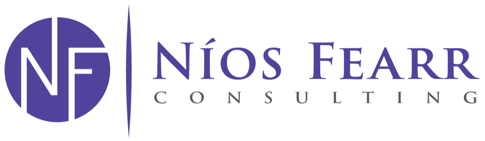

<p align="center">
  
</p>

<h1 align="center">Níos Fearr Consulting Website</h1>

<p align="center">
  Production-ready source code for the official Níos Fearr Consulting web presence
</p>

<p align="center">
  
  
  
  
  
</p>

---

## Overview

This repository contains the complete source code for **Níos Fearr** — a modern, premium brochure-style consultancy website. This is a complete rebuild of the existing Níos Fearr site, designed to be visually polished, fully responsive, and easy to maintain.

Built as a performance-optimized static site with Astro and Tailwind CSS, the platform delivers services, expertise, and values to executive-level stakeholders with precision and polish.

**Purpose of the rebuild:**
- Modernise the visual presentation to reflect a premium, confident brand
- Improve responsiveness across all device sizes
- Create a maintainable codebase that can evolve with the business
- Stay true to the existing brochure content and business positioning
- Provide a polished user experience without over-engineering

**Live site:** [niosfearr.ie](https://niosfearr.ie)

---

## Site Sections

| Section | Description |
|---------|-------------|
| **Homepage** | Hero, trust bar, and core value proposition |
| **Technology Consultancy & Advisory** | Interactive 5-pillar service framework |
| **Developmental Mentoring** | Mentoring offering and approach |
| **A Clear Approach** | Process timeline |
| **Why Us** | Trust signals and differentiators |
| **Testimonials** | Client testimonials carousel |
| **Contact** | Enquiry form and contact details |
| **Careers** | Careers information (separate page) |
| **Legal** | Privacy policy and terms (separate page) |

---

## Tech Stack

| Technology | Version | Purpose |
|------------|---------|---------|
| Astro | 6.x | Static site generator |
| Tailwind CSS | 4.x | Utility-first styling |
| Plus Jakarta Sans | — | Display typography |
| Inter | — | Body typography |
| Swiper | 12.x | Testimonials carousel |

**Hosting:** Cloudflare Pages with GitHub CI/CD

---

## Features

- **Interactive service framework** — Auto-advancing 5-pillar consultancy visualization with state management
- **Fully responsive** — Individually optimized layouts for desktop, tablet, and mobile
- **Client trust bar** — Infinite-scroll logo marquee with hover effects
- **Touch-enabled carousel** — Swiper-powered testimonials with gesture support
- **Zero-dependency contact** — Client-side mailto form with comprehensive validation
- **Performance-focused** — Hardware-accelerated animations and transitions

---

## Implementation Notes

Architectural decisions and engineering approach:

- **Component isolation** — Each section is a self-contained Astro component with encapsulated markup, styles, and behavior. Changes remain localized without unintended side effects.

- **Content decoupling** — All editable content resides in typed TypeScript modules under `src/data/`. Content updates require no component modifications, enabling non-technical maintenance.

- **Responsive precision** — Layouts were individually calibrated across breakpoints with deliberate attention to spacing, typography hierarchy, and interaction affordances.

- **Static optimization** — Astro generates pure HTML/CSS/JS with zero client-side framework overhead. Combined with Cloudflare's edge network, this achieves consistently fast load times.

- **Pragmatic contact solution** — Following stakeholder evaluation, a mailto-based form was chosen over third-party services. This eliminates external dependencies, API management, and ongoing service costs.

- **Maintenance-first structure** — Clear file organization, explicit naming conventions, and accurate documentation ensure seamless handover and future development.

---

## Project Structure

```
nios-fearr/
├── public/
│   └── images/
│       ├── brand/              # Logo and brand assets
│       ├── clients/            # Client logos for trust bar
│       └── favicon/            # Favicon set
│
├── src/
│   ├── components/             # Page section components
│   │   ├── Navbar.astro
│   │   ├── Hero.astro
│   │   ├── TrustBar.astro
│   │   ├── ConsultancyServices.astro
│   │   ├── MentoringSection.astro
│   │   ├── Process.astro
│   │   ├── WhyUs.astro
│   │   ├── Testimonials.astro
│   │   ├── Contact.astro
│   │   └── Footer.astro
│   │
│   ├── data/                   # Centralised content (TypeScript)
│   │   ├── clients.ts
│   │   ├── testimonials.ts
│   │   ├── services.ts
│   │   └── process-steps.ts
│   │
│   ├── layouts/
│   │   └── Layout.astro
│   │
│   ├── pages/
│   │   ├── index.astro
│   │   ├── careers.astro
│   │   └── legal.astro
│   │
│   └── styles/
│       └── global.css
│
├── astro.config.mjs
├── tsconfig.json
├── wrangler.jsonc
└── package.json
```

---

## Requirements

- **Node.js** 18 or higher
- **npm** (included with Node.js)

---

## Development

```bash
# Install dependencies
npm install

# Start development server
npm run dev

# Build for production
npm run build

# Preview production build
npm run preview
```

Dev server runs at `http://localhost:4321`

---

## QA and Testing Case Study

This chapter documents the complete test activities performed for this project, including setup, execution, findings, fixes, and re-validation evidence.

### 1) Goal and Scope

**Goal:** establish reliable, repeatable quality checks for core brochure-site journeys, accessibility, and baseline performance.

**In scope:**
- Public pages: `/`, `/careers`, `/legal`
- Smoke/regression navigation and content checks
- WCAG-focused accessibility checks (axe + practical DOM checks)
- Lighthouse quality checks

**Out of scope:**
- Backend/API testing (site is static)
- Full cross-browser matrix at cloud scale
- Visual regression tooling

### 2) Why Cypress for This Project

Cypress was selected because it provides:
- Fast, low-overhead E2E setup
- Strong assertions for navigation/responsive flows
- First-class integration with `cypress-axe`
- Built-in video and screenshot capture for QA evidence
- Good local debugging (`cypress open`) and CI-style execution (`cypress run`)

### 3) Test Strategy

Layered strategy:
- Layer 1: smoke/regression checks for user-critical paths
- Layer 2: accessibility checks (WCAG2A/WCAG2AA)
- Layer 3: Lighthouse quality checks (performance/accessibility/best-practices/SEO)

Execution approach:
- Local-first validation due deployment access constraints
- Root-cause based fixes (shared classes/tokens), not isolated element patching
- Re-run full suite after changes with evidence capture enabled

### 4) Automated Tests Added

Smoke/regression:
- `cypress/e2e/homepage_content.cy.js`
- `cypress/e2e/navigation_footer_links.cy.js`
- `cypress/e2e/responsive_accessibility_smoke.cy.js`

Accessibility suite:
- `cypress/e2e/a11y/public_pages.a11y.cy.js`

Config and support:
- `cypress.config.js`
- `cypress/support/e2e.js`
- `lighthouse.config.cjs`

### 5) How to Run Test Suites

```bash
# Smoke only
npm run test:e2e:smoke

# Accessibility only
npm run test:e2e:a11y

# Lighthouse only
npm run test:lighthouse

# Combined quality gate
npm run test:quality
```

Full local evidence run (all Cypress specs with video/screenshot capture):

```bash
CYPRESS_BASE_URL=http://localhost:4321 npx cypress run --browser electron --spec "cypress/e2e/**/*.cy.js" --config video=true,screenshotOnRunFailure=true
```

If Astro auto-switches to another port (for example 4322), update `CYPRESS_BASE_URL` and `LHCI_BASE_URL` accordingly.

### 6) Accessibility Issues Found (Root-Cause Grouped)

All issues were WCAG AA normal-text contrast failures (target >= 4.5:1).

- Footer secondary text on dark footer: 3.8:1
- Testimonial company text on white card: 2.84:1
- Testimonial location text on white card: 3.02:1
- Legal subtitle text on white: 3.69:1
- Navbar CTA white-on-magenta: 4.25:1
- Trust bar heading on light gray: 4.07:1
- Careers email link on light panel: 3.94:1

Key QA insight: these failures came from shared style tokens and opacity classes, so fixing source classes resolved multiple occurrences at once.

### 7) Exact Fixes Applied

- `src/components/Footer.astro`: `text-white/40` -> `text-white/50`
- `src/components/Testimonials.astro`: `text-brand-body/50` -> `text-brand-body/70`
- `src/components/Testimonials.astro`: `text-brand-magenta/70` -> `text-brand-magenta-hover`
- `src/pages/legal.astro`: `text-brand-body/60` -> `text-brand-body/70`
- `src/components/Navbar.astro`: `bg-brand-magenta` -> `bg-brand-magenta-hover`
- `src/components/TrustBar.astro`: `text-brand-purple/75` -> `text-brand-purple/85`
- `src/pages/careers.astro`: `text-brand-magenta` -> `text-brand-magenta-hover`

One reliability fix in Cypress:
- `cypress/e2e/responsive_accessibility_smoke.cy.js`: mobile CTA click forced to avoid Astro dev toolbar overlay blocking clicks in local interactive mode.

### 8) Re-Test Results

Full Cypress run:
- Specs: 4
- Tests: 16
- Passed: 16
- Failed: 0

Per-spec:
- `homepage_content.cy.js`: 3/3
- `navigation_footer_links.cy.js`: 4/4
- `responsive_accessibility_smoke.cy.js`: 3/3
- `a11y/public_pages.a11y.cy.js`: 6/6

Lighthouse run:
- 3 URLs x 2 runs each = 6 runs
- Reports generated successfully for all pages
- Mobile homepage performance warning observed at 0.78 against warning target 0.80

### 9) Manual vs Automated Coverage

Automated now:
- Route/content/navigation smoke
- Responsive interaction smoke
- Accessibility scan + structural checks
- Lighthouse baseline

Still recommended manually:
- Final visual review on real devices
- Mailto flow behavior across user mail client setups
- Stakeholder content/legal sign-off

### 10) QA Evidence Artifacts

Generated evidence folders:
- `cypress/videos/` (spec run recordings)
- `cypress/screenshots/` (per-test screenshots)
- `lighthouse-reports/` (HTML/JSON reports + manifest)

### 11) Commit Policy for Testing Files vs Artifacts

Commit:
- Test specs
- Config/support files
- NPM scripts and QA setup code
- Selected QA evidence artifacts intended for review

Keep ignored by default (safety-sensitive or noisy runtime outputs):
- `cypress/downloads/`

For this project, screenshots/videos/reports are intentionally trackable to support walkthroughs.

### 12) Lessons Learned and Best Practices

- Layered automation gives strong confidence quickly on static sites.
- Accessibility tooling is most effective with root-cause analysis.
- Small token-level color changes can clear WCAG AA without redesign.
- Local-first QA keeps delivery moving when deployment access is restricted.
- Evidence (video/screenshots/reports) improves traceability and stakeholder confidence.

### 13) Testing Outcomes

- Designed and implemented a complete QA stack (Cypress + cypress-axe + Lighthouse).
- Defined layered coverage: smoke, accessibility, performance-quality baseline.
- Diagnosed accessibility regressions by shared styling root causes.
- Applied minimal, brand-consistent fixes and re-validated with full evidence.
- Balanced automation with clear manual validation boundaries.

---

## Deployment

The site deploys to **Cloudflare Pages** via two methods:

### Git Integration (Recommended)

Automatic deployment from GitHub:

1. Push to `main` branch
2. Cloudflare triggers build
3. Site live within 1–2 minutes

### Direct Upload (Alternative)

Manual deployment from local build:

1. Run `npm run build` locally
2. Upload `dist/` folder via Cloudflare Pages dashboard
3. Site updates immediately

| Setting | Value |
|---------|-------|
| Build command | `npm run build` |
| Output directory | `dist` |
| Environment variables | None required |

---

## Contact Form

The contact form implements a **mailto-based approach**:

1. User completes the form (name, email, subject, message)
2. Client-side validation executes
3. On submit, the user's email client opens with pre-populated fields
4. User sends from their own email application

This approach eliminates third-party services, API keys, and backend infrastructure. A direct email link provides an alternative path.

**Note:** This flow requires the visitor to have a default email client configured. Most users do, but those relying exclusively on webmail without mailto handlers can use the direct email link.

---

## Design

| Aspect | Approach |
|--------|----------|
| **Palette** | Brand purple (#50439B) primary, magenta (#E91E7B) accent |
| **Typography** | Plus Jakarta Sans headings, Inter body |
| **Layout** | Mobile-first, responsive breakpoints |
| **Animation** | Subtle fade-ins, smooth transitions |

---

## Common Updates

Quick reference for routine maintenance tasks:

| Update | Location |
|--------|----------|
| Contact email | `src/components/Contact.astro` — update `CONTACT_EMAIL` constant |
| Client logos | Add image to `public/images/clients/`, update `src/data/clients.ts` |
| Testimonials | `src/data/testimonials.ts` |
| Services content | `src/data/services.ts` |
| Process steps | `src/data/process-steps.ts` |
| Legal page content | `src/pages/legal.astro` |
| Careers page content | `src/pages/careers.astro` |
| Brand assets | `public/images/brand/` |
| Favicon | `public/images/favicon/` |

---

## Future Enhancements

Potential improvements for consideration:

- Analytics integration (Plausible or Cloudflare Analytics)
- Blog or case studies module
- Advanced image optimization and lazy loading

---

## License

Private project for Níos Fearr Consulting. All rights reserved.